# Linux Image
# Contents
[**Theoretical Background:**	3](#_toc171628834)

[Linux Kernel :	3](#_toc171628835)

[1.	BusyBox vs. Systemd: A Comparison	4](#_toc171628836)

[BusyBox	4](#_toc171628837)

[Systemd	5](#_toc171628838)

[Use Cases	5](#_toc171628839)

[Conclusion	6](#_toc171628840)

[2.	Device Manager	6](#_toc171628841)

[3.	udev/eudev	6](#_toc171628842)

[4.	busybox-mdev	6](#_toc171628843)

[5.	util-linux	7](#_toc171628844)

[**Understanding Through Examples**	7](#_toc171628845)

[**Summary**	7](#_toc171628846)

[**Linux Image**	8](#_toc171628847)

[i. Buildroot	8](#_toc171628848)

[Steps to configure Buildroot for linux image:	8](#_toc171628849)

[Disadvantage:	10](#_toc171628850)

[Testing without Hardware :	10](#_toc171628851)

[ii. Yocto	10](#_toc171628852)

[Therotical Knowledge	11](#_toc171628853)

[Yocto Build	13](#_toc171628854)

[Guide Links :	13](#_toc171628855)

[Requirements:	13](#_toc171628856)

[Initial Setup	14](#_toc171628857)

[Yocto Image Build:	15](#_toc171628858)

[Check config files :	15](#_toc171628859)

[Choosing criteria:	16](#_toc171628860)

[More about layers:	21](#_toc171628861)

[Testing and Deployment:	23](#_toc171628862)

[Flashing process:	23](#_toc171628863)

[Installing Etcher on Ubuntu Using AppImage	23](#_toc171628864)

[Step 1: Download AppImage from Balena’s Website	23](#_toc171628865)

[Step 2: Extract the .zip File	23](#_toc171628866)

[Step 3: Assign Execute Permissions to the AppImage File	24](#_toc171628867)

[Step 4: Run Etcher	25](#_toc171628868)

[Future Work	26](#_toc171628869)

[Device Tree	26](#_toc171628870)

[Platform Identification	27](#_toc171628871)

[Apendix:	27](#_toc171628872)

# **Theoretical Background:**
## **Linux Kernel :**
Definition : it is core component of linux OS and manages both hardware and software interactions , enable multitasking and resource management.

The kernel has 4 jobs:

1. **Memory management:** Keep track of how much memory is used to store what, and where
1. **Process management:** Determine which processes can use the central processing unit (CPU), when, and for how long
1. **Device drivers:** Act as mediator/interpreter between the hardware and processes
1. **System calls and security:** Receive requests for service from the processes

*Think about it like this: The kernel is a busy personal assistant for a powerful executive (the hardware). It’s the assistant’s job to relay messages and requests (processes) from employees and the public (users) to the executive, to remember what is stored where (memory), and to determine who has access to the executive at any given time and for how long.*

[Linux](https://www.redhat.com/en/topics/linux) machine as having 3 layers:

1. **The hardware:** The physical machine—the bottom or base of the system, made up of memory (RAM) and the processor or central processing unit (CPU), as well as input/output (I/O) devices such as [storage](https://www.redhat.com/en/topics/data-storage), [networking](https://www.redhat.com/en/topics/hyperconverged-infrastructure/what-is-software-defined-networking), and graphics. The CPU performs computations and reads from, and writes to, memory.
1. **The Linux kernel:** The core of the OS. (See? It’s right in the middle.) It’s software residing in memory that tells the CPU what to do.
1. **User processes:** These are the running programs that the kernel [manages](https://www.redhat.com/en/topics/management). User processes are what collectively make up user space. User processes are also known as just *processes*. The kernel also allows these processes and servers to communicate with each other (known as inter-process communication, or IPC).

**Source :** <https://www.redhat.com/en/topics/linux/what-is-the-linux-kernel> 

**Linux kernel Subsystem and structure :**

- Process management :

  Manage process lifecycle “how it is created , schedualed and terminated “

- Memory management :

  Responsible for how packet is processed from user space to kernel 

  Kernel has driver responsible for different layers of TCP/IP

- Virtual file:

  Handle different hardware that get plugged into computer
1. ## **BusyBox vs. Systemd: A Comparison**
**BusyBox** and **Systemd** are two distinct systems used in the Linux ecosystem for system initialization and management, each with different design philosophies, features, and use cases. Here is a detailed comparison of the two:
### **BusyBox** 
#### *Overview*
- **Description**: BusyBox is often referred to as the "Swiss Army Knife of Embedded Linux" because it combines many common UNIX utilities into a single small executable, providing minimalist replacements for most of the utilities you usually find in GNU coreutils, util-linux, etc.
- **Primary Use**: BusyBox is designed for environments with limited resources, such as embedded systems. It provides essential utilities for system initialization, scripting, and basic system management.
#### *Features*
- **Size and Performance**: Extremely small footprint, making it ideal for systems with limited storage and memory.
- **Functionality**: Includes basic versions of common commands and utilities, such as ls, cp, mv, init, sh, and more.
- **Init System**: BusyBox includes a simple init system (often referred to as init or busybox init) that can be used to start and manage system services at boot time.
- **Simplicity**: Minimalistic, straightforward design with fewer dependencies.
- **Customization**: Highly configurable at compile time, allowing users to include only the components they need.
#### *Pros*
- **Lightweight**: Minimal resource usage, making it perfect for embedded systems.
- **All-in-One**: Combines many utilities into one package, reducing overhead.
- **Flexibility**: Highly customizable and configurable.
#### *Cons*
- **Limited Functionality**: Provides only basic versions of commands and lacks many advanced features found in their full-fledged counterparts.
- **Basic Init System**: The init system in BusyBox is simple and lacks the advanced capabilities of more modern init systems like systemd.
### **Systemd**
#### *Overview*
- **Description**: Systemd is a system and service manager for Linux operating systems. It is designed to be a comprehensive suite for managing the entire system's boot process and services, aiming to unify service configuration and behavior across Linux distributions.
- **Primary Use**: Systemd is widely used in desktop, server, and some embedded environments, providing advanced service management capabilities and features.
#### *Features*
- **Advanced Init System**: Systemd replaces traditional init systems with a more powerful and flexible service manager.
- **Parallelization**: Capable of starting services in parallel during boot, which can significantly speed up the boot process.
- **Service Dependencies**: Manages dependencies between services, ensuring that services start and stop in the correct order.
- **Unit Files**: Uses unit files (e.g., service, socket, mount) for configuring services, providing a consistent and standardized way to manage system components.
- **Logging**: Integrates with journald for centralized logging.
- **Timers**: Provides timer units as an alternative to cron jobs for scheduling tasks.
- **Socket Activation**: Supports socket-based activation, where services are started on demand when their corresponding sockets receive traffic.
#### *Pros*
- **Feature-Rich**: Offers a wide range of advanced features for service management and system initialization.
- **Efficiency**: Parallel service startup can reduce boot times.
- **Unified Management**: Provides a consistent interface for managing services and system components.
- **Logging**: Integrated logging with journald simplifies log management.
#### *Cons*
- **Complexity**: More complex than traditional init systems, with a steeper learning curve.
- **Resource Usage**: Higher resource usage compared to minimalistic systems like BusyBox.
- **Controversial**: Systemd's design and scope have been controversial within the Linux community, leading to debates about its role and implementation.
### **Use Cases**
- **BusyBox**:
  - Ideal for embedded systems, IoT devices, and minimalist Linux distributions where resource constraints are a primary concern.
  - Suitable for environments that require a minimalistic init system and basic utilities.
- **Systemd**:
  - Suitable for desktop and server environments where advanced service management features and performance optimizations are desired.
  - Appropriate for systems that benefit from the unified and comprehensive approach to system and service management.
### **Conclusion**
Choosing between BusyBox and Systemd depends on the specific needs and constraints of your environment:

- **BusyBox** is the go-to choice for resource-constrained systems, providing essential utilities and a minimalistic init system with a very small footprint.
- **Systemd** is preferred for more robust systems that require advanced service management features, parallel service startup, and comprehensive logging capabilities.

**More about them : <https://www.youtube.com/watch?v=wWA6SvzvElU>**
1. ## **Device Manager**
A device manager in Linux is responsible for managing hardware devices. It handles tasks such as detecting new hardware, loading appropriate drivers, and providing user-space applications with access to device information.

**Example:**

- **udev**: A device manager for the Linux kernel, udev dynamically creates and removes device nodes in the /dev directory. It handles the hotplug events sent by the kernel when a device is added or removed.
1. ## **udev/eudev**
**udev** is the device manager for the Linux kernel that handles dynamic device node creation, permissions, and symlinks. **eudev** is a fork of udev, created by the Gentoo project to be more lightweight and independent of systemd.

**Example:**

- When you plug in a USB drive, udev detects the event, creates a device node in /dev, and can run scripts to mount the drive automatically.
1. ## ` `**busybox-mdev**
mdev is a component of BusyBox that provides a lightweight alternative to udev. It manages device nodes in /dev, making it suitable for embedded systems with limited resources.

**Example:**

- In an embedded Linux system, mdev might be configured to handle device node creation for peripherals like GPIO pins, SPI, or I2C devices, instead of using the heavier udev.
1. ## **util-linux**
**util-linux** is a package of essential system utilities for Linux systems. It includes a wide range of tools for managing disks, filesystems, partitions, and system resources.

**Example:**

- fdisk: A tool included in util-linux for partitioning disks.
- mount: Another util-linux tool used to mount filesystems.

**Understanding Through Examples**

- **Device Manager (udev/eudev)**:
  - **udev**: Suppose you insert a network card into your Linux computer. udev will detect the new hardware, load the appropriate driver, and create the necessary device node in /dev (e.g., /dev/eth0). It might also create a symbolic link like /dev/network-card.
  - **eudev**: Similar to udev but optimized for systems not using systemd. It performs the same tasks but is preferred in certain distributions like Gentoo.
- **busybox-mdev**:
  - In an embedded device, like a home router running a lightweight Linux distribution, mdev manages the /dev directory. When you connect a USB storage device, mdev creates a device node like /dev/sda1 and can trigger scripts to mount the filesystem.
- **util-linux**:
  - Using the mount command from util-linux, you can manually mount a filesystem:

    bash

    Copy code

    mount /dev/sda1 /mnt

  - Partitioning a new hard drive with fdisk:

    bash

    Copy code

    fdisk /dev/sda

**Summary**

- **Device Manager**: Manages hardware devices and creates device nodes. Example: udev dynamically creates /dev nodes for new devices.
- **udev/eudev**: Device managers for Linux. Example: udev detects a new USB drive and creates /dev/sda1.
- **busybox-mdev**: Lightweight device manager in BusyBox. Example: mdev creates /dev/gpio nodes on an embedded system.
- **util-linux**: Collection of essential system utilities. Example: mount command to mount filesystems, fdisk to partition disks.

# **Linux Image** 
Linux is customizable used in embedded device

In this document we will build image using two tools : 
## **i. Buildroot**
### **Steps to configure Buildroot for linux image:**
1. Download Buildroot version 

git clone https://gitlab.com/buildroot.org/buildroot.git

1. Open Terminal 
1. Make sure that you update your current version of ubuntu

sudo apt update

sudo apt upgrade

1. Get into configs file to see what is there

ls configs/

1. You may not have installed ncurse already in your device use :

sudo apt-get install libncurses5-dev libncursesw5-dev

1. Check configs specs

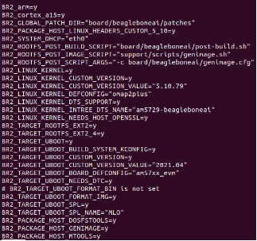

1. To get your config file use

make “Name of configure file you want from ls of configs”

1. Open menu

make menuconfig

Note : error may occur if ncurse library isn’t installed 

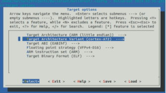

Our beagle bone ai 64 is with processor cortex-A72

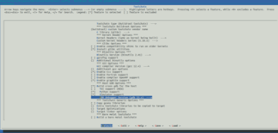

Configuration of tool chain needed

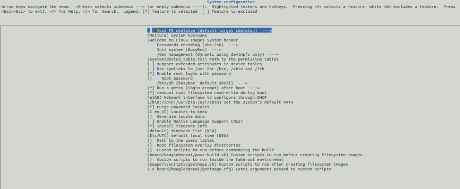

Some custom image

sudo apt install libncurses-dev

1. To start building execute the following command

make

1. Once it is done look for output

ls -la output/images/

1. to upload image to SD-Card :
   - First to list storage devices :

lsblk

- Copy image bit by bit using sudo to have root privileges

sudo dd if=”path of file to be copied” of=”destination to be copied to” bs=”set block size(1M)”

1. To get serial console from board we can install serial terminal

sudo apt install -y picocom

You may need to call out usermod in dialout group to avoid permission denied even using sudo

sudo usermod -a -G dialout $USER

groups $USER

We can now use picocom 

picocom -b “baud rate” “Path of device”

1. Reset the board and if you get login prompt then every thing works fine
- Type root and there is no password for login
- To write script use 

vi “any name”.sh

type I to insert text

after you finished press esc and type :wq

- Exiting picocom 
  7. Ctrl + A
  7. Ctrl + X
### **Disadvantage:**
Any change repeat all this steps again (long time wasted)
### **Testing without Hardware :**
Qemu (<https://cyruscyliu.github.io/posts/2020-11-18-buildroot-qemu-x86_64/> ) :

qemu-system-x86\_64 \

`    `-M pc \

`    `-kernel ./output/images/bzImage \

`    `-drive file=./output/images/rootfs.ext2,if=virtio,format=raw \

`    `-append "root=/dev/vda console=ttyS0" \

`    `-net user,hostfwd=tcp:127.0.0.1:3333-:22 \

`    `-net nic,model=virtio \

`    `-nographic
## **ii. Yocto**
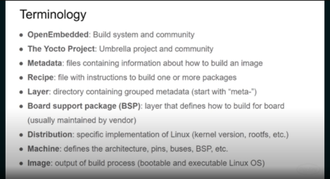

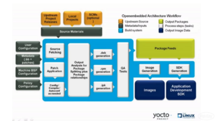
### **Therotical Knowledge**
- Poky is the Yocto Project reference distribution. It contains the [Open-Embedded build system](http://www.yoctoproject.org/docs/2.5/ref-manual/ref-manual.html#build-system-term) (BitBake and OE-Core) as well as a set of metadata to get you started building your own distribution.
- Poky is a base specification of the functionality needed for a typical embedded system as well as the components from the Yocto Project that allow you to build a distribution into a usable binary image.
- BitBake is a task executor and scheduler that is the heart of the OpenEmbedded build system. BitBake will help us build our image
- BitBake’s hierarchical recipes enable individual package build instructions to be maintained independently, but the packages themselves are easily aggregated and built in proper order to create large images. Thus it can build an individual package for later incorporation in a binary feed as well as complete images.

  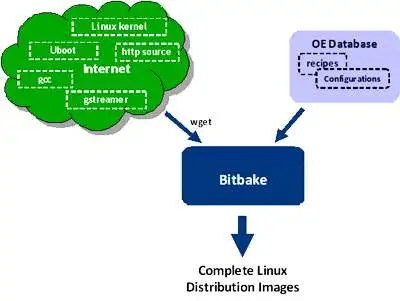

- 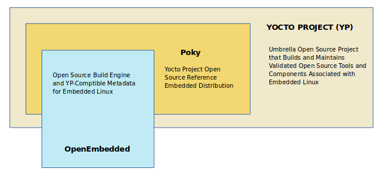Meta-data folders consists of all layers needed in our project
- OE is essentially a database of these recipe (.bb) and configuration (.conf) files that developers can draw on to cross-compile combinations of components for a variety of embedded platforms.
- recipe knows where to access the source for a package, how to build it for a particular target, and ensures that a package’s dependencies are all built as well, relieving developers of the need to understand every piece of software required to add a particular capability to their application.
- ` `The advantage of using an existing distribution is that it will often be necessary to select certain package versions to get a working combination. Distributions address this key function. They often provide a ‘stable’ build in addition to a ‘latest’ build to avoid the inherent instabilities that come from trying to combine the latest versions of everything.
- The recipe simply defines a set of tasks required to build the image. 
- A task recipe is a group of related packages required to bring a block of related features or functionality. For example, a distribution intended for a smart phone might have digital music, digital camera, and contacts book tasks that bring in all the packages needed to provide a particular capability. One of the reasons of such indirection is to abstract sets of packages in tasks, so tasks can be easily re-used in different images.
- Task recipes represent individual aggregations of packages.
- PR represents the Package Revision, which is the version number for package recipe file. 
- PN represents the Package Name.
- while PV(not used here) represents the Package Version, which is the version for the actual package source files. The tasks do not specify most package versions as these are set in the configurations files
- Classes have a peer-to-peer relationship with the other recipes rather than a hierarchical one. They are used to factor out common recipe elements that can then be reused,through the inherit command. The most frequent use of classes is to inherit functions or portions of recipes for commonly used build tools like the GNU autotools.
- ` `bitbake.conf isthe first file read by BitBake and includes all the other configurationfiles. 
- ipkg package manager (it recently switched to opkg), as this has some advantages for space-constrained embedded applicationscompared to desktop package managements like dpkg or RPM. ipk format wasoriginally based on deb format and is handled by either ipkg or opkg package managers, opkg being the newer and preferred one. The packageformat results in additional metadata being stored in the package. Thisensures incompatible packages are not loaded and that the correctrun-time dependencies will be brought in as well.
- <https://www.embedded.com/open-embedded-an-alternative-way-to-build-embedded-linux-distributions/> 
- The root filesystem should generally be small, since it contains very critical files and a small, infrequently modified filesystem has a better chance of not getting corrupted. A corrupted root filesystem will generally mean that the system becomes unbootable except with special measures

  Check releases here : <https://wiki.yoctoproject.org/wiki/Releases> 
### **Yocto Build** 
### **Guide Links :** 
1. [**https://www.digikey.com/en/maker/projects/intro-to-embedded-linux-part-2-yocto-project/2c08a1ad09d74f20b9844e566d332da4](https://www.digikey.com/en/maker/projects/intro-to-embedded-linux-part-2-yocto-project/2c08a1ad09d74f20b9844e566d332da4)** 
1. [**https://docs.yoctoproject.org/brief-yoctoprojectqs/index.html#](https://docs.yoctoproject.org/brief-yoctoprojectqs/index.html)** 
### **Requirements:**
- At least 90 Gbytes of free disk space, though much more will help to run multiple builds and increase performance by reusing build artifacts.
  - We use virtual machine of about 150 GB
- At least 8 Gbytes of RAM, though a modern modern build host with as much RAM and as many CPU cores as possible is strongly recommended to maximize build performance.
  - We allocated 8 GB RAM for virtual machine
- Runs a supported Linux distribution (i.e. recent releases of Fedora, openSUSE, CentOS, Debian, or Ubuntu). For a list of Linux distributions that support the Yocto Project, see the [Supported Linux Distributions](https://docs.yoctoproject.org/ref-manual/system-requirements.html#supported-linux-distributions) section in the Yocto Project Reference Manual. For detailed information on preparing your build host, see the [Preparing the Build Host](https://docs.yoctoproject.org/dev-manual/start.html#preparing-the-build-host) section in the Yocto Project Development Tasks Manual.
  - Git 1.8.3.1 or greater
  - tar 1.28 or greater
  - Python 3.8.0 or greater.
  - gcc 8.0 or greater.
  - GNU make 4.0 or greater
- Python version

  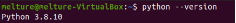
### **Initial Setup**
Because the Yocto Project tools rely on the “python” command, you will likely need to alias “python” to “python3.” Edit your .bashrc file:

Copy Code

**vi** ~/.bashrc

Scroll to the bottom and add the following to a new line (press ‘a’ to append new text):

Copy Code

alias python=python3

Save and exit (‘esc’ followed by entering “:wq”). Re-run the .bashrc script to update your shell:

Copy Code

source ~/.bashrc

Check your Python version:

Copy Code

python --version

It should say something like “Python 3.8.xxx.” 

- Ubuntu Linux distributions
- Installing Essential Host package

$ sudo apt install gawk wget git diffstat unzip texinfo gcc build-essential chrpath socat cpio python3 python3-pip python3-pexpect xz-utils debianutils iputils-ping python3-git python3-jinja2 libegl1-mesa libsdl1.2-dev python3-subunit mesa-common-dev zstd liblz4-tool file locales libacl1

$ sudo locale-gen en\_US.UTF-8

### **Yocto Image Build:**
- Download the Yocto Project poky reference distribution:

mkdir -p ~/Projects/yocto
cd ~/Projects/yocto
git clone git://git.yoctoproject.org/poky.git
cd poky

mkdir : to make a new folder in directory given  with name = “yocto” 

-p : flag is used to create the rest of directory if not exist

cd : change directory from current director to argument specified directory

git clone to clone poky respository from git hub to machine

- Choose branch from poky respoitory : <https://wiki.yoctoproject.org/wiki/Releases> 

Check available branches in the current git

**git** branch -r

Choose the branch that align with yocto version

**git** checkout dunfell

Then check for status

**git** status

![ref1]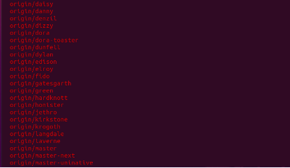
### ` `**Check config files :**
**less** meta-poky/conf/distro/poky.conf

Check SANITY\_TESTED\_DISTROS make sure you work on one of them to avoid errors

![ref1]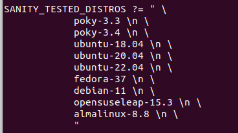

Our virtual machine is ubunto-20.04 so we are safe

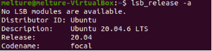
### **Choosing criteria:**
we want the yocto release to line up with poky reference distribution

we need long term support (upto 2 years)

we need codename need to line up with yocto version (check second column)

latest stable release and/or Long Term Support : 

|Kirkstone (like 'kirk stun')|4\.0|May 2022|4\.0.16 (February 2024)|Long Term Support (Apr. 2026¹)|
| :- | :- | :- | :- | :- |
|Dunfell|3\.1|April 2020|3\.1.31 (January 2024)|Long Term Support (until Apr. 2024¹)|

In addition to based on queries and Beagle Bone Community : <https://forum.beagleboard.org/t/bbai-64-yocto-bsp-support/32813/6>  

Note : due to a lot of errors that was encountered while using kirstone branch (this happed to me while building yocto image) we will go with dunfell as it is simple and works completely although kirkstone is most recommended branch of poky 

- Note that you can regularly type the following command in the same directory to keep your local files in sync with the release branch:

$ **git** pull

- In there, you can see that we need the meta-openembedded layer. Specifically, we need the meta-oe and meta-python layers in the meta-openembedded layer (I only found this out by looking at the errors reported during the build process).

cd ~/Projects/yocto
git clone https://github.com/openembedded/meta-openembedded.git
cd meta-openembedded
git checkout dunfell

- Note : throughout the project implementation and deployment don’t change branch
- Initialize the Build Environment: From within the poky directory, run the oe-init-build-env environment setup script to define Yocto Project’s build environment on your build host.

cd ~/Projects/yocto
source poky/oe-init-build-env build-mp1
cd build-mp1

- Add a Hardware Layer

**Find a Layer:** Many hardware layers are available. The Yocto Project [Source Repositories](https://git.yoctoproject.org/) has many hardware layers.

we can either use [meta-ti](https://git.yoctoproject.org/meta-ti/ "meta-ti") or [meta-arago](https://git.yoctoproject.org/meta-arago/ "meta-arago") , we will proceed with meta-arago as this one was tested by numerous users (we may checkout meta-ti if meta-arago build failed)

video about arago distribution (<https://www.ti.com/video/3872288001001#transcript-tab> )

<https://www.youtube.com/watch?v=sGzmfkItVrA> 

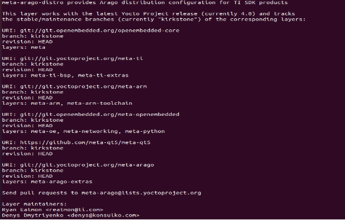

**Clone the Layer:** Use Git to make a local copy of the layer on your machine. You can put the copy in the top level of the copy of the Poky repository created earlier

$ cd poky

$ git clone git://git.yoctoproject.org/meta-arago

**bblayer.conf**

**Note :**  if there is conflict in branches for each layer a error may arise so make sure to change branch of each repository into our selected branch which is kirkstone

**Change the Configuration to Build for a Specific Machine:** The [MACHINE](https://docs.yoctoproject.org/ref-manual/variables.html#term-MACHINE) variable in the local.conf file specifies the machine for the build. For this example,Modify local to conf to generate image with required machine (by default is qemu)

` `MACHINE = "beaglebone-ai64"

You can also modify building process to fit the available resources

$ cd build-mp1

$ vi conf/local.conf

**Add Your Layer to the Layer Configuration File:** Before you can use a layer during a build, you must add it to your bblayers.conf file, which is found in the [Build Directory](https://docs.yoctoproject.org/ref-manual/terms.html#term-Build-Directory) conf directory.

$ cd poky/build

$ bitbake-layers add-layer ../meta-arago

` `Or modifiy bblayer manually and add layer need By checking conf in BSP we can know which layers must be added to yocto build-mp1 to build image successfu

$ cd build-mp1

$ vi conf/bblayers.conf

You can view the layers that will be included in the build with the following:

bitbake-layers **show**-layers

this command will give error if there is confilict between the branch and layer or there is missing dependencies 

**Configure Kernel** :Now that your build system is set up, you can make changes to the kernel. To do that, enter:

bitbake -c menuconfig **virtual**/kernel

Note that the first time you run bitbake for a particular build, it will take some time parsing all the required metadata. This could take an hour or more, depending on your host computer, so be patient.

**Build Image:** The OpenEmbedded build system provides several example images to satisfy different needs. When you issue the bitbake command you provide a “top-level” recipe that essentially begins the build for the type of image you want.

` `We need to choose an image to build , the [available images here](https://docs.yoctoproject.org/ref-manual/images.html)

Lets focus on the bare minimum, which is provided by the core-image-minimal image.

**bitbake** core-image-minimal

One big advantage of the Yocto Project is that it builds everything in stages and layers. If you make any changes (e.g. add a layer, change to a different image, tweak kernel settings), subsequent builds will take far less time. This speeds up development process when you are trying to add low-level support in Linux. We build image using bitbake and we can make change to bitbake

The first run take longer time than the following runs as advantage of yocto is that it tries to memorize where it was last time (~ 10 min)

Build process is done in stages so minor changes to kernals will take smaller time to build over buildroot

If you see any errors, read them carefully! Missing .h files probably means you’re missing a package, so find a way to install it (e.g. apt install). The great news is that the build process will pick up where it left off, so you won’t need to build from scratch again.

Note: Usually "do\_fetch" error or stuck is caused by network issue. Please check your network or change a new network and try in different time.

If you have used yocto to compile successfully before, you can directly copy the relevant files downloaded before to the current project. This way you can skip the "do\_fetch" step.

If you need to start over (e.g. you press ‘ctrl + c’ or something gets corrupted/tainted), you can run the following:

**bitbake** -c cleanall core-image-minimal

If you really want to clean out everything (because something still is not working after calling bitbake cleanall), you can simply delete the tmp folder in your build (e.g. build-mp1) folder:

**rm** -rf tmp

Once building is complete, you can find all of the output images in the deploy folder:

**ls** tmp/deploy/images/”machine”

the produced image will have name of core-image-minimal-beaglebone-ai64.wic.xz

xz is compressed version of image

Note: an error may arise :

to solve it you must make sure that git is configured to allow access to local files using the following command :

git config --global core.longpaths true

and check that this command was done using :

git config --list

### **More about layers:**
1. **meta**: This is the **core layer of the Yocto Project**, also known as Poky. It provides essential recipes, configurations, and tools for building Linux distributions using the Yocto build system. This layer includes basic system components and **serves as the foundation for customizing Yocto-based distributions**.
1. **meta-poky**: This layer is part of the Poky reference system and **provides configurations and recipes specific to the Poky distribution.** It includes settings for the default system configuration, package management, and other Poky-specific features.
1. **meta-yocto-bsp**: This layer contains Board Support Packages (BSPs) for various hardware platforms supported by the Yocto Project. **It provides configurations and recipes tailored to specific boards, including kernel configurations, bootloader settings, and device tree files.**
1. **meta-arago/meta-arago-distro**: This layer is part of the meta-arago project, which focuses on supporting Texas Instruments (TI) platforms with the Yocto Project. **The meta-arago-distro layer defines distributions specific to TI hardware, including configurations and recipes optimized for TI platforms like the BeagleBone series.**
1. **meta-arago/meta-arago-extras**: **This layer provides additional components and configurations beyond the basic meta-arago-distro layer**. It may include extra packages, optimizations, and features tailored for TI platforms.
1. **meta-openembedded/meta-networking**: This layer, part of the OpenEmbedded project, provides recipes and configurations for networking-related software. **It includes packages for network protocols, utilities, and services, enabling networking functionality in Yocto-based distributions.**
1. **meta-openembedded/meta-python**: This layer focuses on Python-related software and provides recipes for Python packages, libraries, and utilities. **It includes tools for Python development, as well as Python bindings for various libraries and frameworks.**
1. **meta-openembedded/meta-oe**: This is a comprehensive layer within the OpenEmbedded ecosystem and contains a wide range of additional recipes and configurations beyond the core Poky layer. **It includes packages for desktop environments, development tools, multimedia software, and much more.**
1. **meta-openembedded/meta-gnome**: This layer specializes in GNOME desktop environment-related packages and configurations. It includes recipes for GNOME desktop components, applications, and libraries, enabling the creation of Yocto-based distributions with GNOME desktop support.
1. **meta-openembedded/meta-filesystems**: This layer focuses on filesystem-related software and provides recipes for various filesystem utilities, formats, and tools. It includes support for different filesystem types and features, such as encryption and compression.
1. **meta-qt5**: This layer focuses on the Qt framework and provides recipes for Qt libraries, tools, and applications. It enables the development of graphical user interfaces (GUIs) using Qt on Yocto-based distributions.
1. **meta-ti/meta-ti-bsp**: This layer is part of the meta-ti project, which focuses on supporting TI platforms with the Yocto Project. The meta-ti-bsp layer provides Board Support Packages (BSPs) for TI hardware, including configurations and recipes tailored to specific TI platforms.
1. **meta-ti/meta-ti-extras**: Similar to meta-arago/meta-arago-extras, this layer provides additional components and configurations specific to TI platforms. It may include extra packages, optimizations, and features beyond the basic meta-ti-bsp layer.
1. **meta-arm/meta-arm**: This layer provides additional support for ARM-based architectures within the Yocto Project. It includes configurations, recipes, and optimizations for building distributions targeting ARM-based hardware platforms.
1. **meta-arm/meta-arm-toolchain**: This layer focuses on toolchain support for ARM architectures. It provides recipes and configurations for cross-compilation toolchains targeting ARM-based systems, enabling development and deployment of software on ARM platforms.
1. **meta-virtualization**: This layer provides support for virtualization-related software and technologies within the Yocto Project. It includes recipes for virtualization tools, hypervisors, and related components, enabling the creation of Yocto-based distributions for virtualized environments.

# Testing and Deployment:
## **Flashing process:**
Refering to this video (<https://www.youtube.com/watch?v=S3NG7ch3Xgw> )
### **Installing Etcher on Ubuntu Using AppImage**
Etcher is available for download as an AppImage, a portable software distribution format. AppImage makes it easy to run applications without having to go through a complicated installation process.

The following steps will help you run Etcher from its AppImage.
### **Step 1: Download AppImage from Balena’s Website**
Visit [Etcher’s official website](https://www.balena.io/etcher/) and download the AppImage for Linux. Since the 18.04 edition, Ubuntu supports only 64-bit architecture, so choose the [x64](https://phoenixnap.com/glossary/what-is-x64) version.

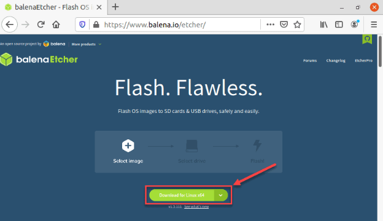
### **Step 2: Extract the .zip File**
1\. Navigate to the location on your drive where you downloaded the .zip file containing AppImage.

2\. Right-click the .zip file and select **Extract Here**.

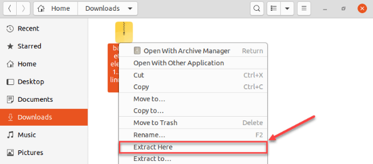

3\. The .zip file extracts to a folder. Navigate to that folder.
### **Step 3: Assign Execute Permissions to the AppImage File**
1\. Right-click the file and select **Properties**.

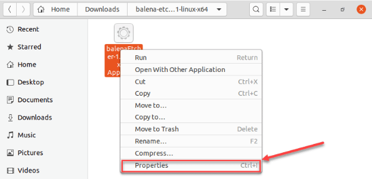

2\. In *Properties*, click the **Permissions** tab.

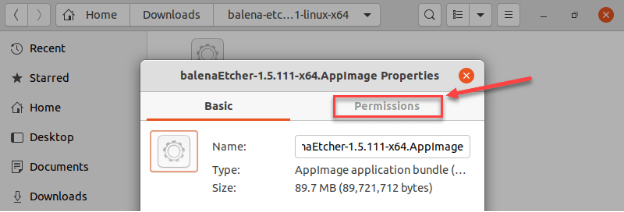

3\. In the *Execute* section of the *Permissions* tab, check the **Allow executing file as a program check box**.

4\. Close the *Properties* dialogue.

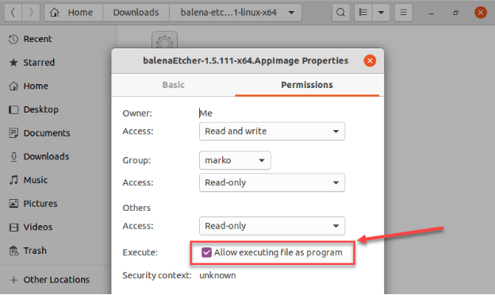
### **Step 4: Run Etcher**
After you give the AppImage permission to run as an application, all you have to do is double-click the app icon and Etcher will start.

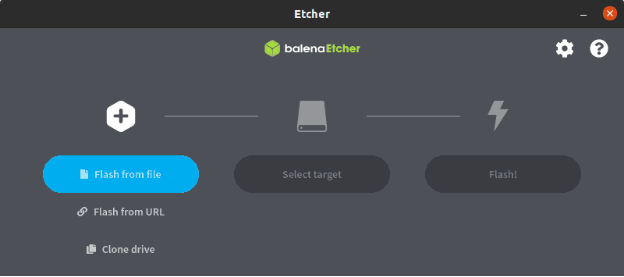

Note: if you are using Virtual Machine, you should mount SD Card or any disk connected to USB in main bar Input>USB and select disk you want to mount.

- Connect SD Card reader to laptop and start flashing
- Then use picocom to monitor board behaviour : 
  - Connect FTDI cable to laptop and run the following commend to ensure it is read

    dmesg | grep ftdi

  - Change directory to /dev

    cd /dev

  - And look for ttyUSB0

    ll ttyUSB0

  - Then prepare Picocom

    picocom -b 115200 /dev/ttyUSB0

  - Finally press boot button down and plug power supply don’t leave button untill there is booting observed in laptop
  - Some tests can be made :

    uname -r

    uname -a

    lsblk
# Future Work
## **Device Tree**
The “Open Firmware Device Tree”, or simply Device tree (DT), is a data structure and language for describing hardware. More specifically, it is a description of hardware that is readable by an operating system so that the operating system doesn’t need to hard code details of the machine.

Linux uses DT data for three major purposes:

1. platform identification,
1. runtime configuration, and
1. device population.
## Platform Identification
First and foremost, the kernel will use data in the DT to identify the specific machine. In a perfect world, the specific platform shouldn’t matter to the kernel because all platform details would be described perfectly by the device tree in a consistent and reliable manner. Hardware is not perfect though, and so the kernel must identify the machine during early boot so that it has the opportunity to run machine-specific fixups.
# Apendix:
\- Dealing with txt file in terminal command window : <https://www.makeuseof.com/vim-vi-delete-line/#:~:text=Highlight%20the%20line%20you%20want,several%20lines%20one%20by%20one>. 

\- Overview Manual : <https://docs.yoctoproject.org/2.5/overview-manual/overview-manual.html#openembedded-build-system-workflow> 

\- Link : <https://www.youtube.com/watch?v=zNLYanJAQ3s> 

\- Yocto image for BBB : <https://www.youtube.com/playlist?list=PLzJTJ1FSIHJtn5gj6oLWnrDpd6dXPSbbG> 

\- Yocto Tutorial : <https://www.digikey.com/en/maker/projects/intro-to-embedded-linux-part-2-yocto-project/2c08a1ad09d74f20b9844e566d332da4>

\- Yocto Customize : <https://youtube.com/playlist?list=PLdUUBf0zT0W9ihkrxXMqK7jf2_wt2xzFS&si=uUR5m9Vlxr9pEu_f> 

<https://youtu.be/6yziQuLvyIE?si=PUi6fnPXijjz6SM2> 

\- Splash Screen : <https://easylinuxji.blogspot.com/2019/03/replace-default-splash-screen-in-yocto.html>

\- Virtual Machine initial Problems solutions: <https://www.youtube.com/watch?v=w4E1iqsn_wA> 

\-  Book Link : <https://www.pdfdrive.com/linux-programming-by-example-e165312568.html> 

\- Yocoto Project :  <https://www.yoctoproject.org/>

\- Embedded Linuxs : <https://www.youtube.com/playlist?list=PLEBQazB0HUyTpoJoZecRK6PpDG31Y7RPB> 

\- Linuxs Kernel : <https://youtu.be/QatE61Ynwrw?si=O3NCac2n1jQIir3O> 

\- Buildroot and Yocto Tutorial : <https://mkaczanowski.com/embedded-development-with-qemu-beagleboard-yocto-angstrom-buildroot-where-to-begin/> 

\- Embedded Vision : <https://www.edge-ai-vision.com/2019/10/building-complete-embedded-vision-systems-on-linux-from-camera-to-display-a-presentation-from-montgomery-one/> 

\- meld library to merge different file

\- all about bash script : <https://www.freecodecamp.org/news/bash-scripting-tutorial-linux-shell-script-and-command-line-for-beginners/#:~:text=A%20bash%20script%20is%20a,process%20using%20the%20command%20line>. 

\- Automated Testing using Script : <https://www.youtube.com/watch?v=CvLm5Ftv6XI> 

\- for qemu : <https://github.com/openbmc/openbmc-build-scripts/blob/master/run-qemu-robot-test.sh> 

Useful Linux command mostly used :

|vi |To edit any file|
| :- | :- |
|top|Open linux task manager (not real-time)|
|htop|
Open real-time task manager require installation (sudo apt install htop)

<https://www.freecodecamp.org/news/linux-list-processes-how-to-check-running-processes/> 
|
|meld|To compare and merge two different files require installation (sudo apt install meld)|
|mv Old\_folder New\_folder |Rename folder directory or move folder|
|nautilus** path|` `Open folder|
|cd path|Change directory|
|ls |List folders/files in current directory|
|less|View (read-only) text file|
|rm -rf file/folder\_name|Completely remove file or folder|
|date|Display Current Date|
|pwd|Display current working directory|
|echo |Print string of text or variable|
|echo >./name.txt|Create text file|
|read variable|Take input from user|
|Bash test.sh|Run script|
|touch filename.extension|Create file|
|||
|||
|||

2

[ref1]: Aspose.Words.f5cedd36-5a52-4071-846f-427a178b3d13.012.png
